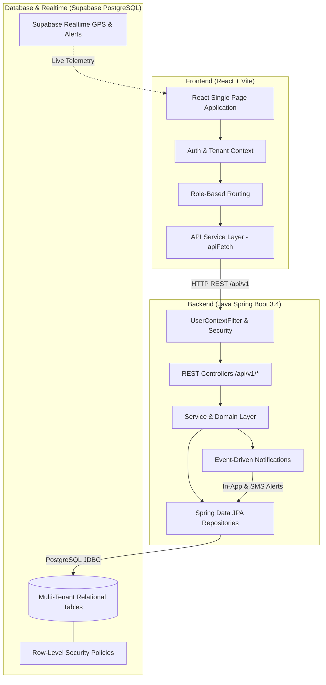
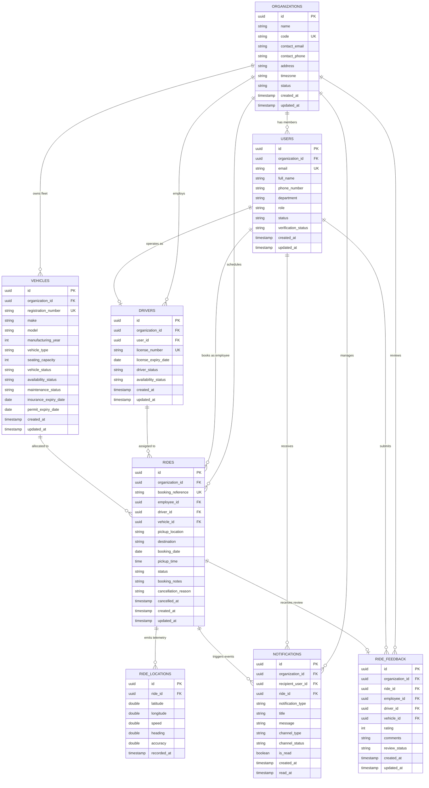

# Ride Scheduling Platform for Corporates

A secure, multi-tenant corporate transportation platform where employees can book office commute rides, transport managers can schedule rides, assign drivers and vehicles, monitor active trips in real time, corporate administrators can manage organization users and roles, and passengers can submit feedback ratings.

---

## 🏛️ System Architecture



---

## 📊 Entity Relationship (ER) Diagram



---

## 🚀 Key Project Features

### 1. Employee Ride Booking
- Book office commute requests with date, pickup time, pickup/drop-off points, and custom notes.
- Real-time booking reference generation (`RIDE-XXXX`) and employee booking lifecycle tracking.
- Self-service cancellation before dispatch.

### 2. Driver Management
- Dedicated driver registry with license verification, license expiration alerts, shift availability toggles (`AVAILABLE`, `ON_TRIP`, `OFF_DUTY`), and active employment statuses.

### 3. Fleet Vehicle Management
- Complete fleet tracking with vehicle make/model, seating capacity, classification (`SEDAN`, `SUV`, `VAN`, `BUS`), registration numbers, insurance/permit validity checks, and maintenance statuses (`GOOD`, `NEEDS_SERVICE`, `UNDER_MAINTENANCE`).

### 4. Ride Scheduling & Approval
- Transport manager dispatch console to review incoming employee ride requests, approve, schedule, reschedule with time conflict checks, or reject with audit notes.

### 5. Driver & Vehicle Resource Assignment
- Intelligent resource allocation preventing driver/vehicle overlap conflicts.
- Real-time validation verifying driver availability, active status, valid licenses, and vehicle compliance before assignment confirmation.

### 6. Real-Time Ride Tracking & Trip Monitoring
- Live driver GPS tracking console emitting coordinates, heading, and speed telemetry.
- Manager monitoring dashboard displaying live fleet locations and stale telemetry alerts.
- State-machine trip lifecycle transitions (`ASSIGNED` $\to$ `IN_PROGRESS` $\to$ `COMPLETED`).

### 7. Notification System & SMS Integration
- Event-driven notifications dispatched on all major trip lifecycle events (`RIDE_BOOKED`, `RIDE_SCHEDULED`, `DRIVER_ASSIGNED`, `TRIP_STARTED`, `TRIP_COMPLETED`, `LOW_RIDE_RATING`).
- Dual-channel delivery supporting in-app notification center and Twilio SMS fallback integration.

### 8. Transportation Reporting & Operational Analytics
- Executive overview dashboards featuring completion rates, cancellation ratios, average scheduling lead times, and passenger volumes.
- Peak-hour surge identification, route corridor demand analysis, driver/vehicle utilization metrics, capacity surplus/risk analysis, and raw CSV exports.

### 9. Corporate Admin & Multi-Tenant Organization Management
- Complete tenant boundaries with organization profile controls (immutable organization code, address, timezone, and contact details).
- User and employee onboarding, role assignments (`EMPLOYEE`, `DRIVER`, `TRANSPORT_MANAGER`, `CORPORATE_ADMIN`), account status toggles (`ACTIVE`, `SUSPENDED`, `DEACTIVATED`), and last-admin protection safeguards.

### 10. Feedback & Rating System
- 1–5 star passenger ratings and experience reviews for completed journeys.
- Anti-Gravity service quality intelligence: automatic low-rating detection ($\le 2$ stars) with manager escalation alerts, repeated driver complaint tracking, vehicle inspection recommendations, and route quality reviews.

---

## 🛠️ Technology Stack

- **Frontend**: React 19, Vite, Lucide Icons, Vanilla CSS Design System
- **Backend**: Java 17, Spring Boot 3.4, Spring Data JPA, Spring Security, Lombok
- **Database**: Supabase PostgreSQL with Row-Level Security (RLS)
- **Real-Time**: Supabase Realtime for GPS tracking and alerts

---

## ⚡ Getting Started

### 1. Prerequisites
- Java 17+ JDK
- Node.js 18+ and npm
- Supabase PostgreSQL Database

### 2. Backend Setup
```bash
cd backend
./mvnw clean spring-boot:run
```
*(On Windows: `.\mvnw.cmd spring-boot:run`)*

Backend will start on `http://localhost:8080`.

### 3. Frontend Setup
```bash
cd frontend
npm install
npm run dev
```
Frontend will start on `http://localhost:5173`.

---

## 🧪 Running Tests

### Backend Unit & Integration Tests (119/119 passing)
```bash
cd backend
.\mvnw.cmd test
```

### Frontend Production Build Verification
```bash
cd frontend
npm run build
```

---

## 🔒 Security & Multi-Tenancy

- **Tenant Isolation**: Every API endpoint derives `organization_id` strictly from authenticated security context (`UserPrincipal`).
- **Row-Level Security**: Enabled across all Supabase PostgreSQL tables.
- **Role-Based Access Control**: Strict RBAC rules for `EMPLOYEE`, `DRIVER`, `TRANSPORT_MANAGER`, `CORPORATE_ADMIN`, and `SYSTEM_ADMIN`.
